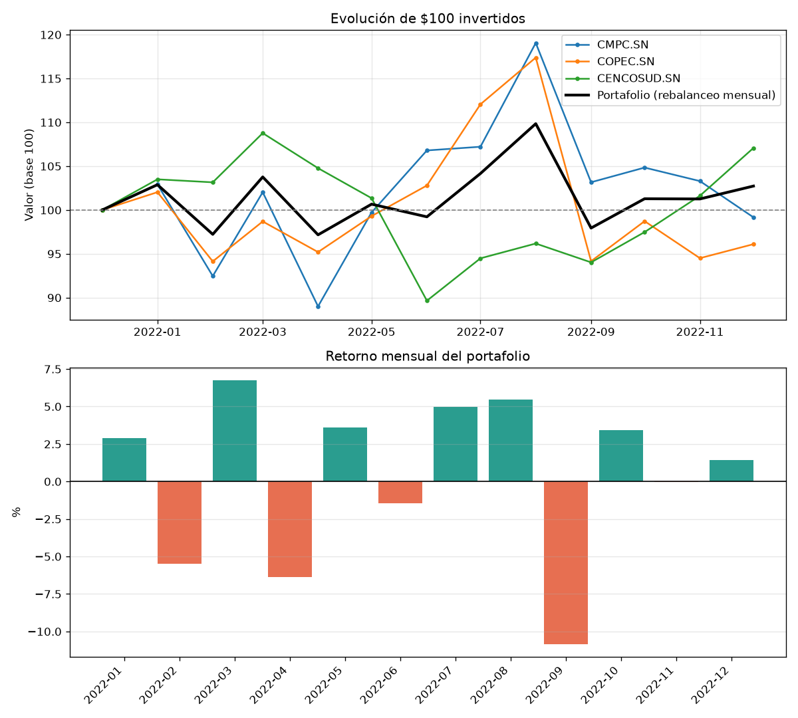

# Análisis de retorno de un portafolio de acciones con Python

[](https://www.python.org/)
[](LICENSE)
[](https://github.com/ranaroussi/yfinance)

**Demostración práctica de cómo usar Python para analizar el retorno y el riesgo
de un portafolio de inversiones**, con datos reales descargados de **Yahoo
Finance** mediante la librería de código abierto
[`yfinance`](https://github.com/ranaroussi/yfinance).

El proyecto nació como tarea del curso **Mercado de Capitales** (MBA,
**Universidad Viña del Mar**), pero está planteado como una **herramienta
reutilizable**: cualquier persona puede cambiar las acciones, los pesos y las
fechas y obtener el mismo análisis para su propia cartera. El caso resuelto en
detalle —tres acciones chilenas durante 2022— funciona como **ejemplo
demostrativo** del flujo de trabajo, no como un fin en sí mismo.

> **Qué se demuestra aquí**
> 1. Descargar series históricas de precios con `yfinance` (una sola llamada).
> 2. Pasar de precios a **retornos** y de retornos de activos a **retorno de
>    portafolio**, con las dos convenciones estándar (comprar y mantener /
>    rebalanceo).
> 3. Medir el **riesgo**: volatilidad y correlaciones (marco media–varianza de
>    Markowitz, 1952).
> 4. Empaquetar todo en un **script con línea de comandos** y un **notebook**
>    reproducibles.

---

## 🎯 Caso de demostración

> Descargar los datos históricos **mensuales** de Yahoo Finance para:
>
> | Empresa | Ticker | Bolsa |
> |---------|--------|-------|
> | Empresas CMPC S.A. | `CMPC.SN` | Santiago |
> | Empresas Copec S.A. | `COPEC.SN` | Santiago |
> | Cencosud S.A. | `CENCOSUD.SN` | Santiago |
>
> Asumiendo una inversión de **30 % en CMPC**, **30 % en Copec** y
> **40 % en Cencosud**: **¿cuál fue el retorno del portafolio durante 2022?**

### Resultado

Con **precios de cierre ajustados** (incluyen dividendos y splits) y la ventana
de año calendario (base = cierre de diciembre 2021):

| Método | Retorno del portafolio en 2022 |
|--------|:------------------------------:|
| **Comprar y mantener** (`Σ wᵢ · Rᵢ`) — *respuesta principal* | **≈ +1,41 %** |
| Rebalanceo mensual a 30/30/40 | ≈ +2,73 % |
| *(Referencia)* con cierre **sin ajustar**, solo ganancia de capital | ≈ −2,27 % |

**Descomposición (comprar y mantener):**

| Activo | Peso | Retorno 2022 | Contribución |
|--------|:----:|:------------:|:------------:|
| CMPC.SN | 30 % | −0,83 % | −0,25 pp |
| COPEC.SN | 30 % | −3,90 % | −1,17 pp |
| CENCOSUD.SN | 40 % | +7,08 % | +2,83 pp |
| **Portafolio** | 100 % | | **+1,41 pp** |

El portafolio terminó **en positivo** gracias a **Cencosud (+7,1 %)**, que
compensó las caídas de CMPC y Copec (ambas del sector celulosa/forestal y muy
correlacionadas entre sí, ρ ≈ 0,75).

> Los valores exactos pueden variar en centésimas al reejecutar, porque Yahoo
> Finance recalcula los factores de ajuste por dividendos con el tiempo. La
> conclusión no cambia. Detalle completo, fórmulas y fuentes en
> **[docs/METODOLOGIA.md](docs/METODOLOGIA.md)**.



---

## 🚀 Cómo ejecutarlo

### 1. Requisitos

* Python 3.10 o superior
* Conexión a internet (para descargar los precios)

### 2. Instalación

```bash
git clone https://github.com/gabrieltovarj/analisis-portafolio-inversiones.git
cd analisis-portafolio-inversiones

python -m venv .venv
# Windows:
.venv\Scripts\activate
# macOS / Linux:
source .venv/bin/activate

pip install -r requirements.txt
```

### 3. Reproducir el caso de demostración

```bash
python src/analisis_portafolio.py
```

Imprime el reporte en consola y regenera:

```
data/precios_historicos.csv               precios mensuales descargados
data/retornos_mensuales_activos.csv       retornos mensuales por acción
results/retornos_mensuales_portafolio.csv retorno mensual del portafolio
results/resumen.json                      todos los números del análisis
results/portafolio.png                    gráfico
```

### 4. Analizar TU propia cartera

Cambia tickers, pesos y fechas por línea de comandos:

```bash
# Cartera tecnológica de EE. UU., año 2023
python src/analisis_portafolio.py \
    --tickers AAPL MSFT NVDA \
    --pesos   0.40 0.40 0.20 \
    --inicio 2022-12-01 --fin 2023-12-31 --intervalo 1mo

# Acción local vs. índice, datos diarios de 2020
python src/analisis_portafolio.py \
    --tickers SQM-B.SN CMPC.SN --pesos 0.5 0.5 \
    --inicio 2019-12-31 --fin 2020-12-31 --intervalo 1d --periodos-anio 252
```

Los pesos se **normalizan automáticamente** para que sumen 1. Todas las
opciones:

```bash
python src/analisis_portafolio.py --help
```

### 5. Notebook

Exploración paso a paso, con el código y los gráficos comentados:
[`notebooks/analisis_portafolio.ipynb`](notebooks/analisis_portafolio.ipynb).

```bash
jupyter notebook notebooks/analisis_portafolio.ipynb
```

---

## 🧮 Metodología (resumen)

1. **Precio** — se usa el **cierre ajustado** (`Adj Close`), que incorpora
   dividendos y splits y mide el **retorno total** del accionista
   (Bacon, 2008).
2. **Retorno simple mensual del activo:** `Rᵢ,ₜ = Pᵢ,ₜ / Pᵢ,ₜ₋₁ − 1`.
3. **Retorno del portafolio — comprar y mantener:** promedio ponderado de los
   retornos del período con los pesos iniciales, `Rₚ = Σ wᵢ · Rᵢ`.
4. **Retorno del portafolio — rebalanceo mensual:** se compone (producto) la
   serie `Rₚ,ₜ = Σ wᵢ · Rᵢ,ₜ`.
5. **Riesgo:** desviación estándar mensual y anualizada (`σ·√12`) y matriz de
   correlaciones — los insumos del marco media–varianza de Markowitz (1952).

Detalle completo, fórmulas en LaTeX, tabla de precios y discusión del
resultado: **[docs/METODOLOGIA.md](docs/METODOLOGIA.md)**.

---

## 📁 Estructura del repositorio

```
analisis-portafolio-inversiones/
├── README.md                  este archivo
├── LICENSE                     MIT
├── requirements.txt            dependencias
├── CITATION.cff                cómo citar este trabajo
├── src/
│   └── analisis_portafolio.py  script + CLI + funciones reutilizables
├── notebooks/
│   └── analisis_portafolio.ipynb
├── docs/
│   ├── METODOLOGIA.md          metodología detallada y fundamento teórico
│   └── referencias.bib         bibliografía (BibTeX)
├── data/                       precios y retornos descargados (CSV)
└── results/                    resumen.json, CSV y gráfico generados
```

---

## 📚 Bibliografía

Referencias completas en [`docs/referencias.bib`](docs/referencias.bib).

- **Markowitz, H. M. (1952).** Portfolio Selection. *The Journal of Finance*, 7(1), 77–91. https://doi.org/10.2307/2975974
- **Sharpe, W. F. (1964).** Capital Asset Prices: A Theory of Market Equilibrium under Conditions of Risk. *The Journal of Finance*, 19(3), 425–442. https://doi.org/10.2307/2977928
- **Brinson, G. P., Hood, L. R., & Beebower, G. L. (1986).** Determinants of Portfolio Performance. *Financial Analysts Journal*, 42(4), 39–44. https://doi.org/10.2469/faj.v42.n4.39
- **Fama, E. F., & French, K. R. (1993).** Common risk factors in the returns on stocks and bonds. *Journal of Financial Economics*, 33(1), 3–56. https://doi.org/10.1016/0304-405X(93)90023-5
- **DeMiguel, V., Garlappi, L., & Uppal, R. (2009).** Optimal Versus Naive Diversification. *The Review of Financial Studies*, 22(5), 1915–1953. https://doi.org/10.1093/rfs/hhm075
- **Meucci, A. (2010).** Linear vs. Compounded Returns – Common Pitfalls in Portfolio Management. *GARP Risk Professional*, April 2010, 49–51.
- **Bacon, C. R. (2008).** *Practical Portfolio Performance Measurement and Attribution* (2nd ed.). Wiley.
- **Bodie, Z., Kane, A., & Marcus, A. J. (2014).** *Investments* (10th ed.). McGraw-Hill.

Herramientas: `yfinance` (Aroussi, 2024), `pandas` (McKinney, 2010), `NumPy`
(Harris et al., 2020), `Matplotlib` (Hunter, 2007).

---

## ⚠️ Aviso

Este material tiene **fines exclusivamente académicos y educativos**. No
constituye asesoría de inversión ni recomendación de compra o venta de
instrumentos financieros. El rendimiento histórico no garantiza resultados
futuros. Los datos provienen de Yahoo Finance y no han sido auditados contra
una segunda fuente.

## 📝 Licencia

Código y documentación bajo licencia [MIT](LICENSE). La librería `yfinance` se
distribuye bajo Apache-2.0 y no está afiliada a Yahoo, Inc.

## ✍️ Cómo citar

Ver [`CITATION.cff`](CITATION.cff). GitHub genera automáticamente la cita en
APA/BibTeX desde el botón **"Cite this repository"**.
